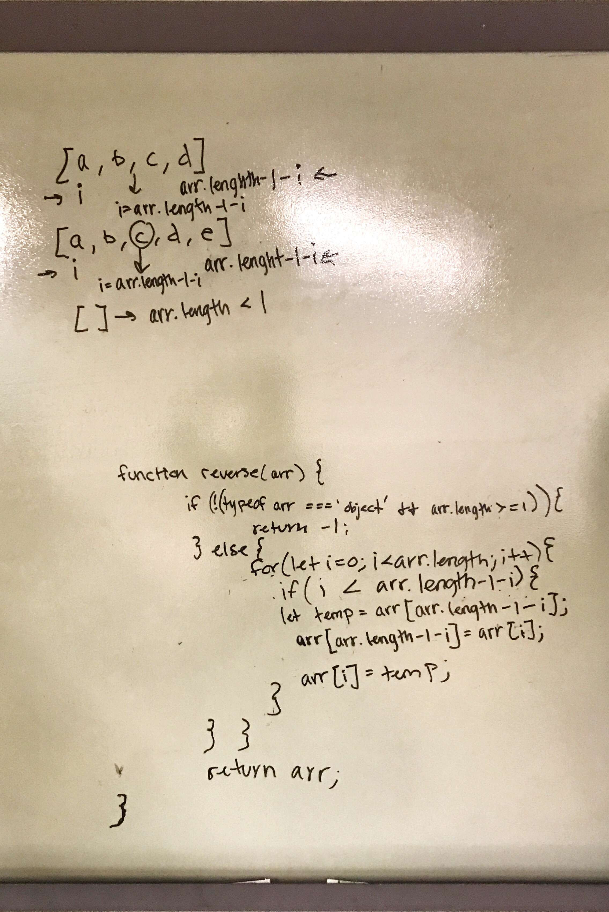

# data-structures-and-algorithms

#Table of Contents

## Reverse an Array

The idea is to reverse an array in place. 

### Challenge

arrayReverse: creates a function that takes in an array and returns the same array with the values in reverse order.  No array methods are used, the array is sorted in place, and empty arrays and non-array objects return -1.

### Approach & Efficiency

As array methods were disallowed as were array methods, I chose to use a for loop and a temp variable to iterate through the array and to swap the necessary variables.  Big O = O(N);

### Solution

## Singly Linked List
A linked list is a data structure that is composed of nodes.  The list iteself is just a reference to the first node in the list. 

### Challenge
The challenge was to build linked list and it's required methods

### Approach & Efficiency
insertAtHead() - O(k)
includes(value) - O(N)
traverse() - O(N)
toString() - O(N)
remove() - O(k)

