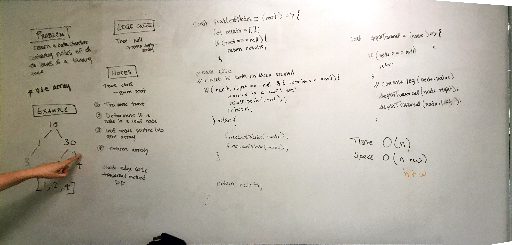

## Find all the Leaf Nodes in a Binary Tree

Find all the nodes with no children.

### Challenge

findLeafNodes(root), will traverse a binary tree and return a data-structure with a record of each leaf node. 
### Approach & Efficiency

Use recursion to iterate over the tree passing in the data structure to the recursive function and adding the leaf nodes to the chosen data structure. 
 
Time: the solution must iterate over the whole tree so time is O(n).

Space: The recursion will use a stack that in the worst cast will hold a number of function equal to the height of the tree (log n), additionally, we'll push data to an array which will at maximum require the same number of nodes as the max width of the tree 2^h. Which leaves us with O(log n + w) or O(n).

### Solution

