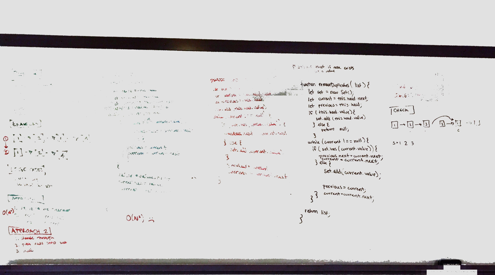
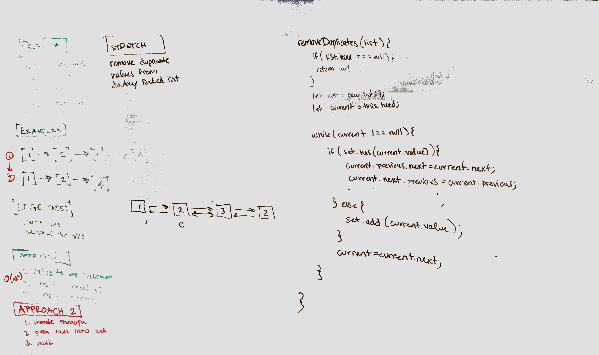

## Remove double from a linked List

### Challenge

Remove duplicate nodes from a doubly linked list

### Approach & Efficiency

Iterate through the list, add the node values to a set, check the set for the current node value and reassign references if necessary. 

Time: O(N) - you must iterate through the whole list
Space: O(k) - In the worst case there are no duplicates and the set contains the same number of values as the list has nodes

### Solution

