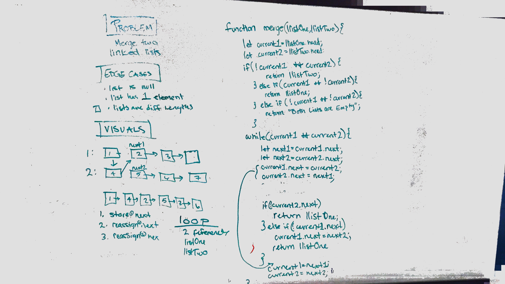

## Merge Two Linked Lists

Merge two linked lists into a single list alternating nodes

### Challenge

Merge two linked lists by alternating nodes

### Approach & Efficiency

Track both the nodes you're working with and the next values so you don't lose any references. 

Time: O(N) - where N is the length of the smaller list
Space: O(k) - you only create 4 variables and no additional data structures. 

### Solution

