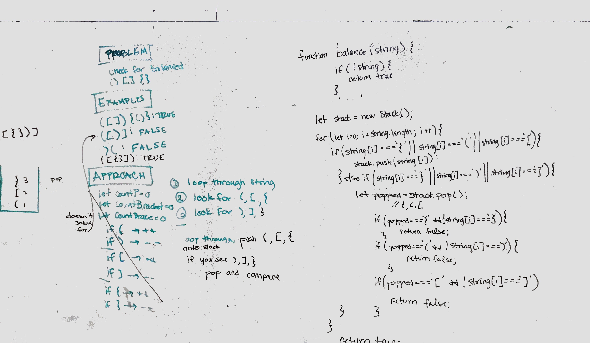

## Check for Balanced Brackets

The idea is to a string to see if all the brackets are balanced

### Challenge

multiBracketValidation(input) takes a string and checks that all kinds of brackets `[]`,`{}`, `()` are balanced.   

### Approach & Efficiency

The idea is to use a stack to store all instances of an open bracket.  When a closed bracket is reached, pop off the stack and make sure the popped value is the pair of the current value being checked. 

The solution uses a for loop of length = input.length, so Time: O(n)

Additionally, in the worst case a stack of length = input.length would be needed to store a string of open parentheses. So Space: O(n)

### Solution

