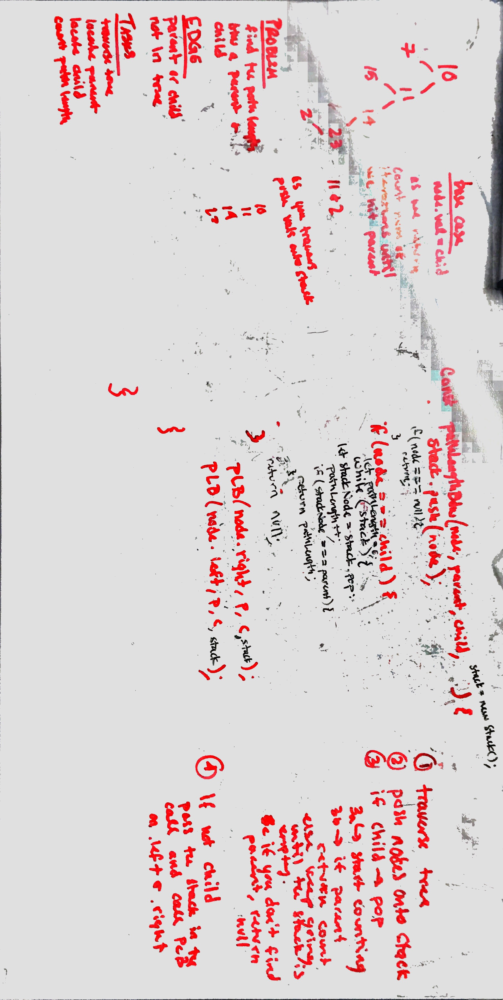

## Find Path Length

Given a Binary Tree, find the path length between parent and child nodes. 
### Challenge

Find the path length between a Parent and Child node in a Binary Tree   

### Approach & Efficiency

We need to traverse the tree, find the parent, and then count each time we have to go down a level to check if the current node is the child. 
Time: O(N);
Space: O(log n);

### Solution

