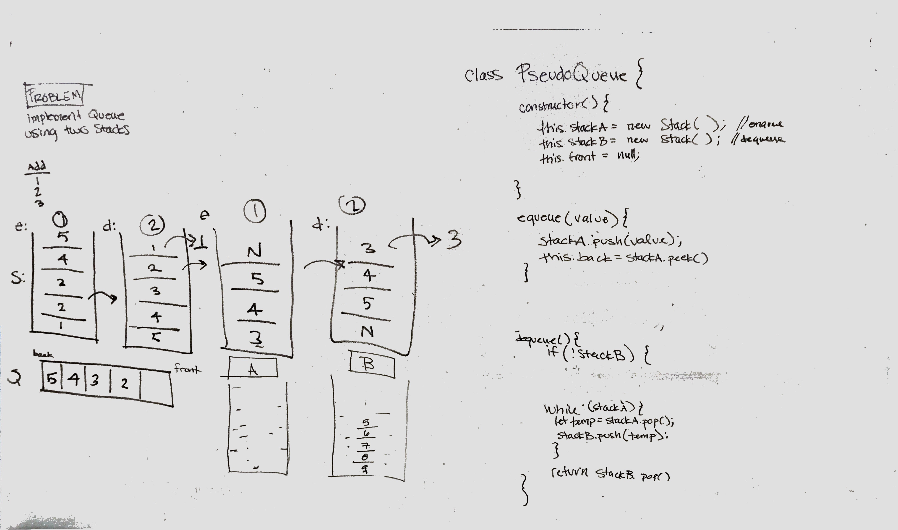

# Challenge Summary
Build a Queue using two stacks

## Challenge Description
Building the enqueue() and dequeue() methods of a Queue using two stacks as the underlying data structures.

## Approach & Efficiency
enqueue() - Time: O(k), Space: O(k)
dequeue() - Time: O(N), Space: O(k)

## Solution
