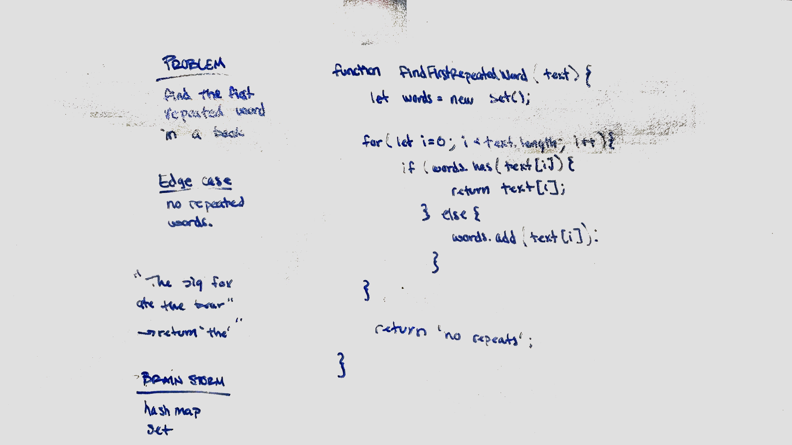

## Find the first repeated word in a string

Given a lengthy string, find the first repeated word.
 
### Challenge

Find the first repeated word in a book   

### Approach & Efficiency

1. Regex the string
2. Loop through array
3. add words to set
4. Check against Set
 
Time: O(N);
Space: O(N);

### Solution

