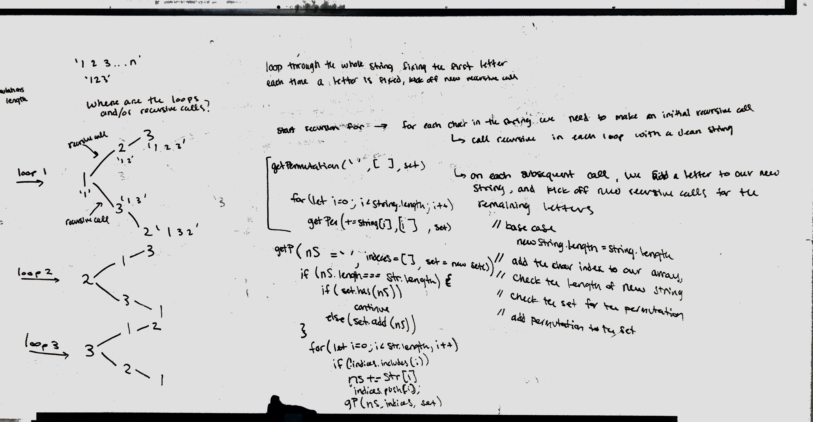

## Find all the permutations of a string

Given a string, return a set containing all the possible permutations
 
### Challenge

Find the permutations of a string

### Approach & Efficiency

1. create a loop that iterates over the whole string
2. build a permutation by fixing one letter and cycling through the rest of the letters using the loop
3. only go one letter at a time until all letters have been used.
 
Time: O(N!);
Space: O(N!);

### Solution

