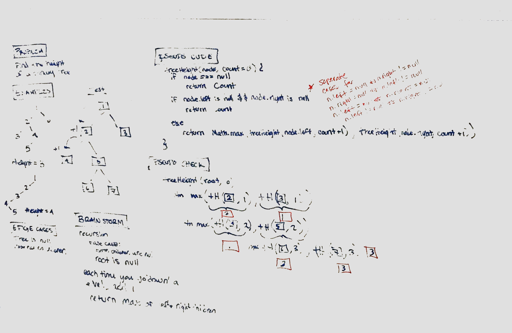
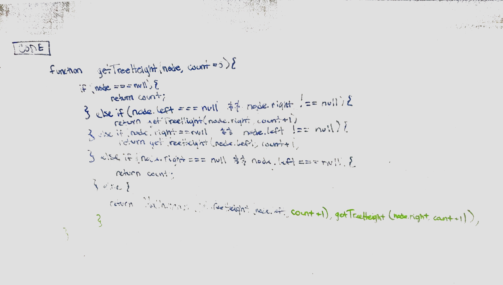

## Find the height of a binary tree

### Challenge

given a binary tree, find the height
 
### Approach & Efficiency

Using recursion, do a depth first traversal of the tree adding one to the count each time you go down a level. 
 
Time: the solution must iterate over the whole tree so time is O(n).

Space: the recursion will use a call stack that in worst case will be the height of the tree in worst case O(N), and O(logn) for a balanced tree.

### Solution

